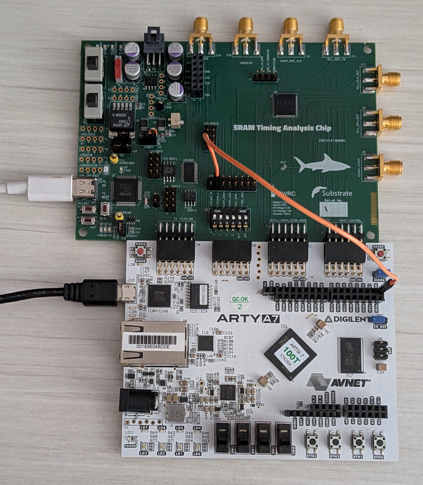

# STAC2 Bringup

Bringup code for the SRAM Timing Analysis Chip 2 (STAC2). These repos may also be useful for bringup:
- [STAC RTL and VLSI flow](https://github.com/ucb-bar/stac-top)
- [STAC PCB](https://github.com/rahulk29/stac-pcb)

## Setup

Requirements:
- [openFPGALoader](https://trabucayre.github.io/openFPGALoader/guide/install.html)
- [Rust](https://rust-lang.org/tools/install/)
- [uv](https://docs.astral.sh/uv/getting-started/installation/#installation-methods)
- [evcxr](https://github.com/evcxr/evcxr/blob/main/evcxr_repl/README.md)
- STAC 2 evaluation board
- Arty A7-100T FPGA development board

Your bringup setup should look like this:


Checklist:
- Use 4 headers to short right two pins of J2/J3, left two pins of J18, and pins of J19.
- Ensure that both clksel switches (two leftmost switches of S5) are in the upmost position.
  Remaining switches should be in the lower position.
- All 3 big switches (S1, S2, S3) should be in the lower position.
- CK_RST header of the FPGA should not be shorted.
- A female-to-male jumper cable should be used to connect IO0 on the FPGA to pin 3 of J12 (bottom row, second to left).

Connect the STAC board and FPGA via PMODs and connect the USBs of the two boards to a host computer.
Note their respective serial ports. Update the config in `Stac.toml` with these serial ports.

Flash the FPGA with the latest bitstream:

```bash
openFPGALoader -b arty_a7_100t --write-flash --verify --reset fpga/Stac2BringupTop.bit
```

At this point:
- The green, blue, and red LEDs at the top of the STAC2 evaluation board should be on.
- The LEDs at the bottom of the FPGA should be changing colors.

You may have to wait some time for the FPGA LEDs to start strobing after the new bitstream has been flashed.

Start an `evcxr` repl from the root of this repo:

```bash
evcxr
```

In the `evcxr` repl, run the following commands:

```rs
:dep stac2 = { path = "rs" }
use stac2::*;
let mut l = BringupState::new();
```

Try initializing the chip:

```rs
l.init_chip();
```

You should see the following output. If you don't, something is probably wrong with the setup.

```bash
Chip initialized!
()
```

You should then be able to write and read scratchpad memory on chip:

```rs
l.tsi_intf().write(SCRATCHPAD_BASE, 0xdeadbeef);
l.tsi_intf().read(SCRATCHPAD_BASE)
```

Available tests can be found in `rs/tests.rs`. To run the MATS+ test on SRAM 0:

```rs
l.mats_plus_tsi_test_sram(0)
```

Other useful functions:

```rs
l.enable_clk();  // Enable chip clock.
l.disable_clk(); // Disable chip clock.
l.reset_chip();  // Reset chip.
```

The chip can also be physically reset using BTN0 on the FPGA.
The reset switches on the STAC2 evaluation board are not functional.


## Development

### Organization

- `fpga/` - FPGA collateral and scripts.

- `py/` - A Python environment for bringup protocols such as `bebe_host` and `pyuartsi`.

- `rs/` - A Rust crate with code for exercising the chip.

- `scala/` A Scala package with code for generating the FPGA bitstream. Also has some utilities
    for probing STAC RTL relevant to bringup.

- `Stac.toml` - Bringup configuration.

### Writing chip tests

Available chip registers are located in `rs/memory.rs`. Available FPGA registers are located in `rs/tsi.rs`.
Chip tests should be declared in `rs/tests.rs` as methods on `BringupState`. Reference `BringupState::march_cm_rand_tsi_test_sram_all`.

### Updating the FPGA bitstream

Requirements:
- [chippy](https://github.com/ucb-substrate/chippy)

To modify FPGA MMIO registers, update `scala/Controller.scala`.

To update top level RTL (e.g. top level IOs), update `scala/Stac2Bringup.scala`.
If you modify top level IOs, you will also have to modify `fpga/stac2_bringup.xdc`.
If you modify clocks, you will have to modify `fpga/stac2_bringup.sdc`.

To regenerate the bitstream, run the following from the `scala/` directory with `vivado` on PATH:

```bash
./mill test.testOnly "*" -- -z bitstream
```

The generated bitstream will be located at `scala/build/Stac2Bringup_should_generate_Arty100T_bitstream/obj/Stac2Bringup.bit`.
If it will be used repeatedly, copy it to the `fpga/` folder. Use a new name unless the bitstream is a strict feature superset of the existing `Stac2Bringup.bit`.
